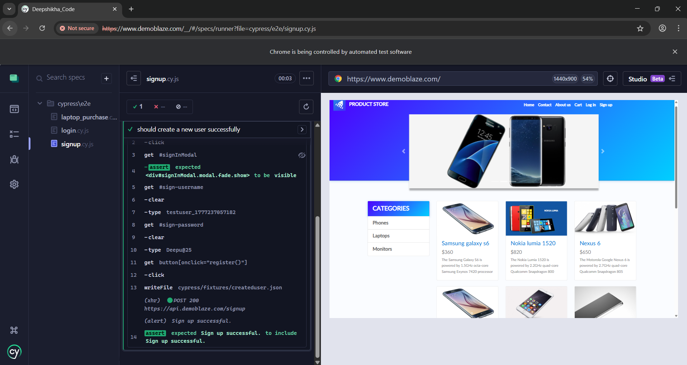
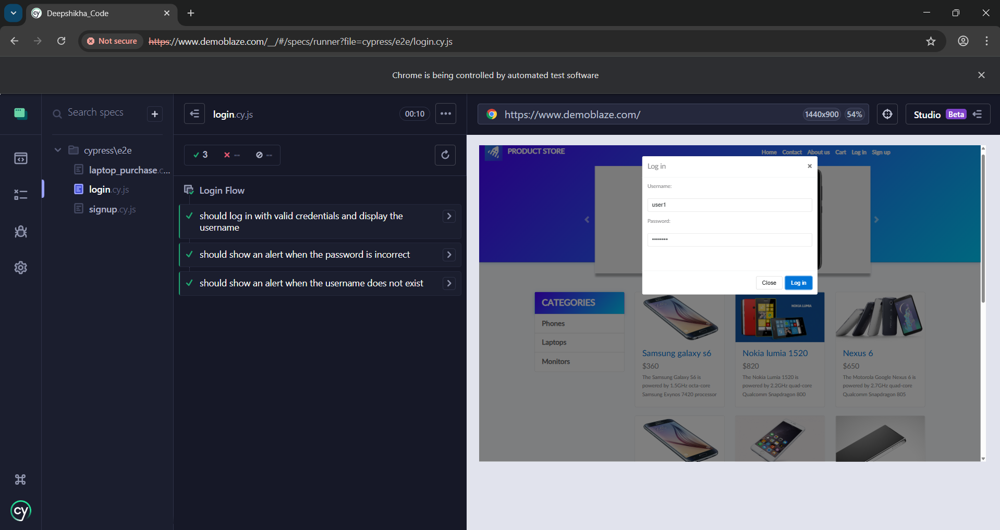
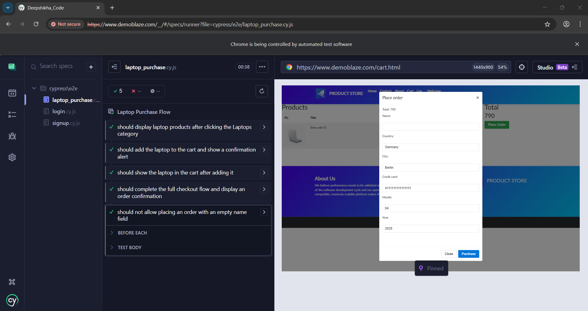

# Demoblaze Cypress Automation Challenge

End-to-end tests for [demoblaze.com](https://www.demoblaze.com) covering signup, login and the full laptop purchase flow, built with Cypress using the Page Object Model pattern.

---

## What's Being Tested

The test suite covers two main user journeys on the Demoblaze demo shop:
**Signup** (`signup.cy.js`)

- Signing in with new credentials by creating them dynamically

**Login** (`login.cy.js`)

- Logging in with credentials created after signup and verifying the username appears in the navigation
- Entering a wrong password which should trigger an alert
- Trying a username that doesn't exist which should trigger an alert

**Laptop Purchase** (`laptop_purchase.cy.js`)

- Browsing to the Laptops category and checking products load
- Adding a specific laptop (Sony Vaio i5) to the cart
- Verifying the item shows up in the cart
- Completing the full checkout flow from cart → place order → confirmation
- Trying to place an order with an empty name field to verify the validation behavior

---

## Project Structure

```
cypress/
├── e2e/
|   ├── signup.cy.js             # Signup test scenario
│   ├── login.cy.js              # Login test scenarios
│   └── laptop_purchase.cy.js    # Purchase flow tests
├── fixtures/
│   ├── userdata.json            # Signup password
│   ├── productdata.json         # Product to use in tests
│   └── checkoutdata.json        # Checkout form details
│   └── createduser.json         # Login Credentials after signing up
├── pages/
│   ├── HomePage.js              # Nav, login modal, product navigation
│   ├── LoginPage.js             # Login form interactions
│   ├── SignupPage.js            # Signup form interactions
│   ├── ProductPage.js           # Product detail and add-to-cart
│   └── CartPage.js              # Cart, order modal, confirmation
└── support/
    ├── commands.js              # Custom commands (login, category nav)
    └── e2e.js                   # Global exception suppression
cypress.config.js                # Base URL, timeouts, viewport
package.json
```

---

## Setup

**Prerequisites:** Node.js

```bash
npm install
```

---

## Running the Tests

Open the Cypress GUI (For debugging):

```bash
npm run cy:open
```

Run headlessly :

```bash
npm run cy:run
```

Run in headed mode:

```bash
npm run cy:run:headed
```

---

## Configuration

Configured in `cypress.config.js`:

| Setting                | Value                       |
| ---------------------- | --------------------------- |
| Base URL               | `https://www.demoblaze.com` |
| Default timeout        | 10,000ms                    |
| Viewport               | 1440 × 900                  |
| Screenshots on failure | Enabled                     |
| Video recording        | Disabled                    |

---

## Test Data

All test data lives in the `fixtures/` folder which can be updated without touching the test logic.

**`userdata.json`** — the account used to signup  
**`createduser.json`** — the account used to login during tests which is created after signup
**`productdata.json`** — the laptop name to search for and add to cart  
**`checkoutdata.json`** — name, country, city, card number, month, and year for the order form

To test with a different account or product, update the relevant fixture file.

---

## Page Object Pattern

Each page of the site has its own class in `cypress/pages/`. The classes expose named getters for elements and chainable methods for common actions.

```js
HomePage.selectLaptopsCategory();
HomePage.clickProduct(productdata.laptopName);
ProductPage.addToCart();
CartPage.visit();
CartPage.assertProductInCart(productdata.laptopName);
```

There's also a `cy.login()` custom command that handles the full login sequence, used in `beforeEach` across the purchase tests so each scenario starts authenticated.

---

## Screenshots

### Cypress Execution







## Notes

- The site uses alerts for feedback (add-to-cart, validation errors), the tests handle these with `cy.on('window:alert', ...)` listeners
- The checkout confirmation uses SweetAlert modals; `CartPage.assertOrderConfirmed()` waits for the `.sweet-alert` element to appear before asserting

## AI usage disclosure

AI tools were used only as a support aid for:

- brainstorming the initial coverage scope
- fixing one of the scenarios related to alert on empty username field while checkout
- improving the wording and structure of the README
